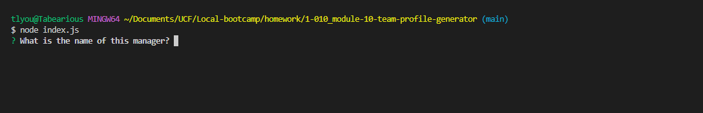

# Team Profile Generator 

## Description 

This project is to create a basic, low custom splash page for basic team member information.
It helps in keeping contact information and important information easily accessible.
 
## Table of Contents
 
- [Installation](#installation)
- [Usage](#usage)
- [Credits](#credits)
- [License](#license)
- [Questions](#questions)
- [Tests](#tests) 

##  Installation 

install inquirer@8.2.4, install jest@24.9.0 

## Usage 

Creates a webpage for employees based on inputs using module inquirer.

 
(https://app.castify.com/view/ea8438d1-44be-46c0-9f7c-cc353807a1da)"Click on this image to view walkthrough video"

## Credits 

n/a

## License 

MIT License 
Please refer to License in repository.  
 
## Questions 

If you have any questions or concerns, please reach out to Tab-Y at tlyoumans@gmail.com. 

## Tests 

Tested for functions using jest